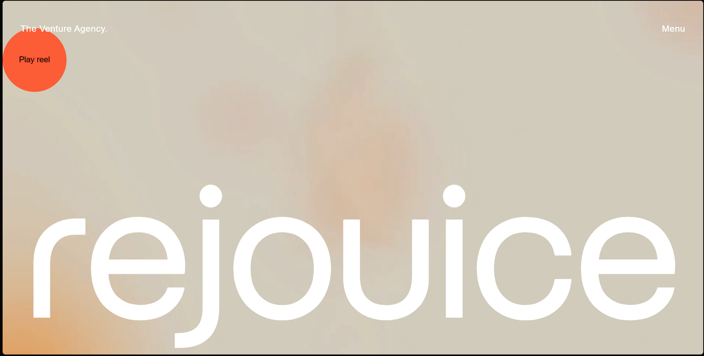

# **Rejoice - Awwwards Clone**

A pixel-perfect clone of the Awwwards website showcasing award-winning designs. Built using Next.js, React, GSAP, Swiper JS, and Framer Motion, this project focuses on performance optimization, smooth animations, and cross-browser compatibility.

## Features
- **Responsive Design**: Fully responsive layout for all device sizes.
- **Smooth Animations**: Animated transitions and elements using GSAP and Framer Motion.
- **Image Slider**: Smooth image carousel powered by Swiper JS.
- **Search Bar**: Quickly find award-winning projects using the search bar.
- **SEO Optimized**: Enhanced SEO with dynamic meta tags and server-side rendering.

## Screenshots

1. **Home Page**  
   Displays the homepage with the featured award-winning projects.

   

2. **Project Detail Page**  
   Shows a detailed view of each project with animations and smooth transitions.

   


## Live Demo

You can view a live version of the Rejoice project by clicking the link below:

[Live Demo](https://rejoice-nu.vercel.app/)

## Installation

### 1. Clone the repository
First, clone the repository to your local machine.

```bash
https://github.com/peyush-nuwal/rejoice.git

```


### 2. Install dependencies
Navigate to the project directory and install the required dependencies.

```bash
cd rejoice
npm install
```

### 3. Set up your local environment
Make sure you have Node.js installed on your local machine. You can check if Node.js is installed by running:

```bash
node -v

```


###4. Run the application locally
To start the development server, run the following command:

```bash
npm run dev
```


### 5. Build and deploy
To build the application for production, run the following command:

```bash

npm run build
```

